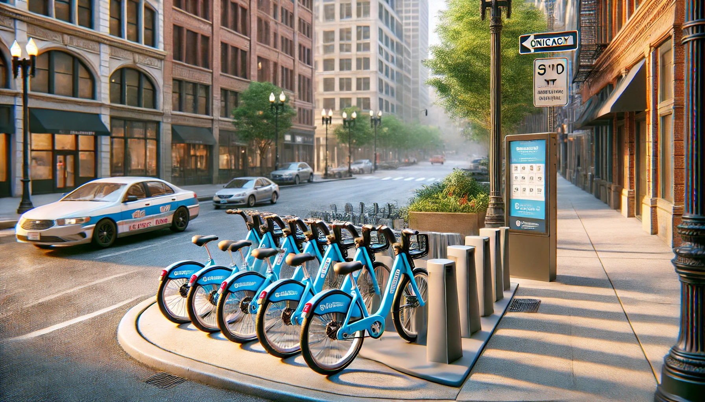

# **CASE STUDY: CYCLISTIC BIKE-SHARE DATA ANALYSIS PROJECT**



**The Case Study from Google Data Analytics Professional Certificate: Cyclistic Bike Share Analysis for Marketing Purposes**

## Table of Contents
- [About the Company](#about-the-company)
- [Scenario](#scenario)
- [Key Stakeholders](#key-stakeholders)
- [Key Business Tasks](#key-business-tasks)
- [Key Business Objectives](#key-business-objectives)
- [Project Structure](#project-structure)
- [Key Data Processing and Analysis](#key-data-processing-and-analysis)
- [Data Visualization and Key Takeaway](#data-visualization-and-key-takeaway)
- [Significant Tools](#significant-tools)
- [Expected Outcomes](#expected-outcomes)
- [Contributor](#contributor)


## ABOUT THE COMPANY
Cyclistic launched a bike-share program in 2016, growing to a fleet of 5,824 tracked bikes across 692 stations in Chicago. The bikes can be unlocked from one station and returned to any other. Cyclistic offers flexible pricing plans: single-ride passes, full-day passes, and annual memberships. Casual riders purchase single-ride or full-day passes, while annual memberships are for Cyclistic members.  

Financial analysts have found that annual members are more profitable than casual riders. Despite the pricing flexibility attracting more customers, the goal is to increase the number of annual members for future growth. Moreno, the Director of Marketing, believes converting casual riders into members is a viable strategy since they are already familiar with Cyclistic.  

The marketing team needs to understand the differences between casual riders and annual members, why casual riders might buy a membership, and how digital media could influence marketing tactics. They aim to analyze historical bike trip data to identify trends and design targeted marketing strategies.

## SCENARIO


#### Marketing Team
As a junior data analyst in Cyclistic's Marketing Analysis Team, your goal is to understand the different usage patterns between casual riders and annual members. The Director of Marketing believes increasing annual memberships is key to Cyclistic's success. Your team will use these insights to design a marketing strategy aimed at converting casual riders into annual members. To gain executive approval, your recommendations must be supported by compelling data insights and professional visualizations.

## KEY STAKEHOLDERS

> 1. **Lily Moreno:** The director of marketing and my manager. Moreno is responsible for the development of campaigns and initiatives to promote the bike-share program. 
> 2. **Cyclistic marketing analytics team:** A team of data analysts who are responsible for collecting, analyzing, and reporting data that helps guide Cyclistic marketing strategy. 
> 3. **Cyclistic executive team:** A notoriously detail-oriented team that will decide whether to approve the recommended marketing program.

## KEY BUSINESS TASKS
> 1. How do annual members and casual riders use Cyclistic bikes differently?
> 2. Why would casual riders buy Cyclistic annual memberships?
> 3. How can Cyclistic use digital media to influence casual riders to become members?

## KEY BUSINESS OBJECTIVES
1. **Understand Key Insights**: Gain a comprehensive understanding of bike riders' preferences, differentiate between member and casual riders, and analyze the specific needs of each user type for different bike models.
2. **Leverage Growth Profits**: Utilize the insights from financial analysts who emphasize that increasing the number of annual members will significantly boost profitability.
3. **Critical Marketing Influence Timing**: Identify the optimal times for marketing efforts to effectively influence casual riders to consider annual memberships and to maximize growth in membership numbers.
4. **Data-Driven Decision Making**: Use key insights from data analysis to secure executive approval for a marketing plan and strategy. Ensure that recommendations are actionable and profitable, backed by thorough database insights.

## PROJECT STRUCTURE
1. **Data Collection**: Gathering historical bike trip data from Cyclistic's database.
2. **Data Cleaning**: Ensuring data accuracy and completeness by handling missing values, duplicates, and inconsistencies.
3. **Data Analysis**: Performing exploratory data analysis (EDA) to identify trends and patterns in bike usage among casual riders and annual members.
4. **Visualization**: Creating professional visualizations to effectively communicate findings to stakeholders.
5. **Recommendation**: Formulating actionable marketing strategies based on data insights to convert casual riders into annual members.
6. **Presentation**: Preparing a comprehensive presentation to secure executive approval for the proposed marketing strategy.

## KEY DATA PROCESSING AND ANALYSIS
### **Data Collection**
- The public data has been made available by Motivate International Inc. under license: [Data License Agreement | Divvy Bikes](https://divvybikes.com/data-license-agreement).
- The downloaded original dataset from Cyclistic is reliable, accurate, and comprehensive, with complete and unbiased information, proven fit for use.
- To access the original public dataset source, visit: [Divvy Trip Data](https://divvy-tripdata.s3.amazonaws.com/index.html).

### **Data Cleaning and Modeling**

#### **Example Detailed Steps:**
1. **Loading Data:**
   - Import necessary libraries (`pandas`, `os`, etc.).
   - Load the CSV files into dataframes.
   ```python
   import pandas as pd
   import os

   # Load each month's data
   jan_data = pd.read_csv('202201-divvy-tripdata.csv')
   feb_data = pd.read_csv('202202-divvy-tripdata.csv')
   # Continue for all months...
   
- The preliminary data cleaning step begins with loading 12 CSV files, each representing a one-month dataset of the year 2022, into the Jupyter Notebook using Python3 (ipykernel).
- Data cleaning ensures data accuracy and completeness by handling missing values, duplicates, and inconsistencies.
- Here is my essential data cleaning and modeling process: [Python Script](https://github.com/roenseed/bike-project/blob/main/bike_clean.ipynb).


## **DATA VISUALIZATION AND KEY TAKEAWAY** 

***FIGURE 1: ANALYSIS 2022 QUARTERLY RIDER TRENDS***:
In 2022, a total of 4,291,961 rider transactions were recorded.

- **Quarter 1**: 9% (379K Transactions)
- **Quarter 2**: 32% (1.3M Transactions)
- **Quarter 3**: 41% (1.7M Transactions)
- **Quarter 4**: 18% (789K Transactions)

Quarters 2 and 3 significantly illustrate all users in the year 2022, showing peak bike user trends during these periods.


***FIGURE 2: 2022 MONTHLY RIDER TRENDS***:
The visualization illustrates the strong seasonal trend, the bell curve trend visualization represents monthly user data with an average line, providing a clear view of trends over the year 2022.

- **Higher Rider Counts from May to October**: Monthly rider counts exceeded the average during these months.


***FIGURE 3: ANALYSIS 2022 CHICAGO WEATHER DIMENSION***:
The visualization illustrates the 2022 Monthly Chicago temperature
- **Temperature Relevant**: the temperature significantly influenced the bike users in the year 2022, as compared to Figure 2 the pattern is almost the same
- **Biker Preferences**: The analysis indicates that favorable weather conditions are crucial for bikers in Chicago, with more riders opting to bike during warmer, pleasant weather.


***FIGURE 4: 2022 CASUAL RIDER BY RIDEABLE TYPE TRENDS***:
This analysis presents Casual rider preferences for bike types on a monthly basis and highlights the interesting trends in the increasing use of electric bikes.
- **Casual Behavior**: Casual rides experienced a significant upward trend from April to July, with a growth of 232% (total growth 215K rides).
- **Electric Bike Trends**: From October to December, there was a notable increase in electric bike usage compared to classic bike rides.

.png)
***FIGURE 5: WEEKDAY RIDER TREND IN RIDE LENGTH (HOURS)***:
The visualization illustrates the trend in ride length hours by weekday dimension.
- **Weekend Peak**: A clear pattern emerges showing that ride lengths during the weekends are higher than on workdays. This suggests that riders significantly prefer to ride bikes on weekends, possibly due to more free time and leisure activities.


***FIGURE 6: 2022 TOP TEN MOST POPULAR BIKE RETURN STATIONS***:
This analysis identifies the most popular bike return stations, helping to inform a focused marketing strategy for 2023.
- **Most Returned Station**: The Streeter Dr & Grand Ave station had the highest number of bike returns, with a total of 71,188 returns.
- **Top Stations for Marketing Focus**: The top four stations collectively had 186,601 bike returns in 2022, providing a substantial target for marketing efforts.

Analyzing the trend of the top most returned bike stations enables the marketing team to launch targeted campaigns, ensuring high-quality traffic and optimizing budget allocation for maximum marketing impact via out of home media optimization.

### **Power BI Dashboard** 

***Figure 7***: This Power BI interactive dashboard provides a comprehensive view of key metrics related to bike usage. On a single page, you can explore various aspects such as total rentals, peak usage times, most popular end stations, and user demographics. The dashboard allows for dynamic interaction, enabling users to drill down into specific data points and gain deeper insights into bike-sharing patterns and trends.

- The more detailed data analysis, data visualization, and key recommendations are available in the following [Google Slides](https://docs.google.com/presentation/d/1RweCTyHVJmDOKCTltEDRNM9NS0aJVja-HP7lH7xn124/edit?usp=sharing)

## SIGNIFICANT TOOLS
- **Jupyter Notebook using Python3 (ipykernel)**: For data extraction, transformation, and loading (ETL), detailed in the data combining, data cleaning, and data modeling processes.
- **Pandas:** Used extensively for data manipulation, including merging, cleaning, and transformation.
- **Power BI**: For creating dashboards.
- **Tableau**: For data visualization.

## EXPECTED OUTCOMES
- A detailed understanding of the differences between casual riders and annual members.
- Identification of key factors that influence casual riders to become annual members.
- Data-driven marketing strategies to increase the number of annual memberships.
- Professional visualizations and a comprehensive presentation to support the proposed marketing strategies.
- Actionable Insights: Formulate clear strategies based on data analysis.


## CONTRIBUTOR
- **[CHAROEN KASETRUENGPHOL]**: A Data Analyst, responsible for data collection, cleaning, analysis, visualization, and presenting findings.

---

This project is part of the Google Data Analytics Professional Certificate and aims to provide practical experience in data analysis, visualization, and strategic decision-making based on data insights.
